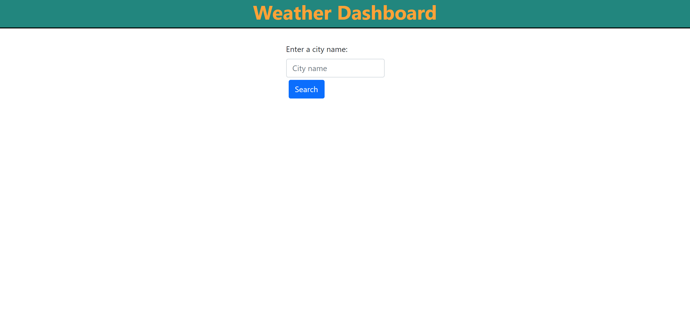
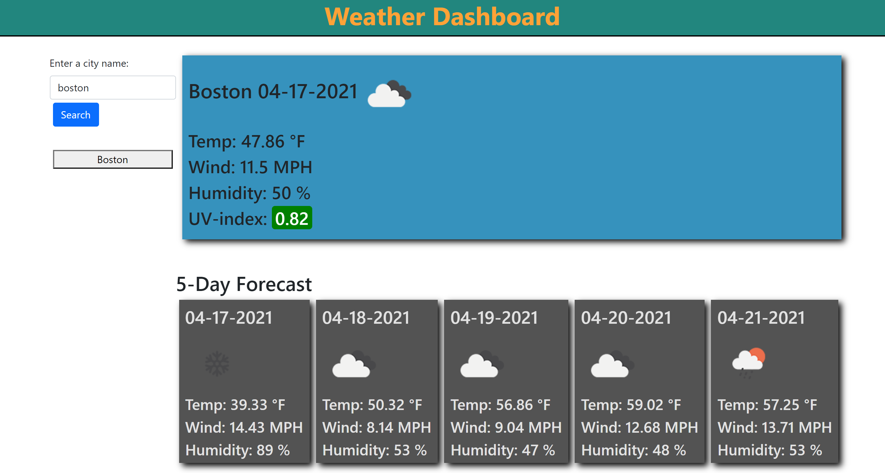

# 06-Server-Side-APIs-Weather-Dashboard

## Description

This app allows you to search for currnet and future weather conditions by city name. Once a city has been searched, the city is saved to local storage and I button is appended to the search section. When the button is clicked, the app will reload data for that city.

## Link to deployed App

https://deucedadorian.github.io/06-Server-Side-APIs-Weather-Dashboard/

## Table of Contents
- [Usage](#usage)
- [Technology Used](#technologyused)
- [Screenshots](#screenshots)
- [License](#license)
- [Contact](#contact)

## Usage

type a city name into the search box. cards will appear containing current and future weather data. A button will be appended to the document under the search box. Click the button to see weather conditions for that city.

## Technology Used

* HTML
* CSS
* JavaScript
* Day.js
* zepto.js

## Screenshots

## Contact

### Email

Dylan Cole <logboarddjc@gmail.com>

## License

MIT License

Copyright (c) [2021] [Dylan Cole]
